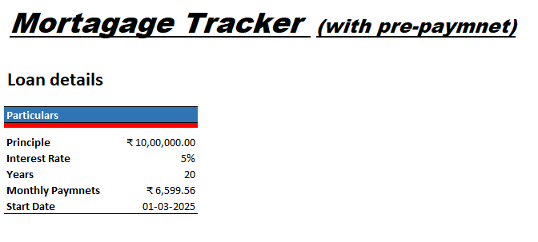
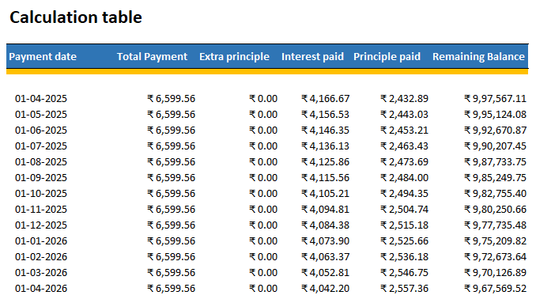

# Mortgage Tracker with Pre-Payment

An Excel-based Mortgage Tracker designed to calculate monthly loan payments, interest paid, principal repayment, remaining balance, and additional principal payments.

This project demonstrates the use of Excel formulas and financial modeling techniques to create a structured mortgage amortization schedule.

---

## Project Overview

The Mortgage Tracker helps analyze a loan throughout its repayment period.

The model includes:

- Loan principal
- Interest rate
- Loan tenure
- Monthly payment
- Interest paid
- Principal paid
- Additional principal / pre-payment
- Remaining loan balance
- Monthly amortization schedule

---

## Excel Model

You can access the complete Excel model here:

[📊 Download Mortgage Tracker Excel Model](Mortgage_Calculator.xlsx)

---

## Loan Details

The example model contains the following loan assumptions:

---

## Model Structure

The calculation table tracks the loan month by month.

Each period calculates:

- Payment Date
- Total Payment
- Extra Principal
- Interest Paid
- Principal Paid
- Remaining Balance

The model can also be extended to analyze the impact of additional principal payments on the outstanding loan balance.

---

## Project Purpose

The purpose of this project is to demonstrate practical financial modeling skills by building a mortgage repayment tracker in Microsoft Excel.

It can be used to understand how monthly payments are divided between interest and principal and how additional principal payments can affect the outstanding loan balance.

---

## Author

Utkarsh Singh Malra

Finance & Financial Analytics Enthusiast
